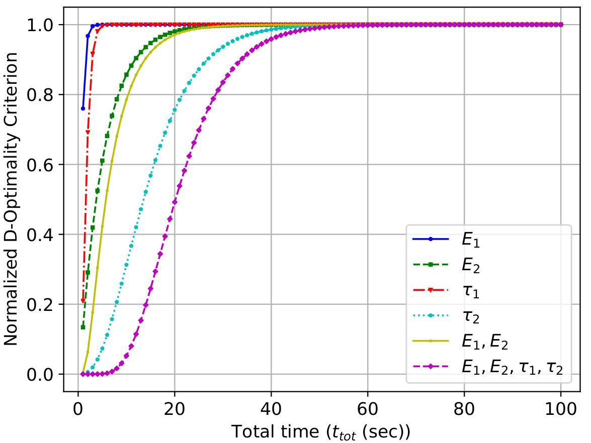
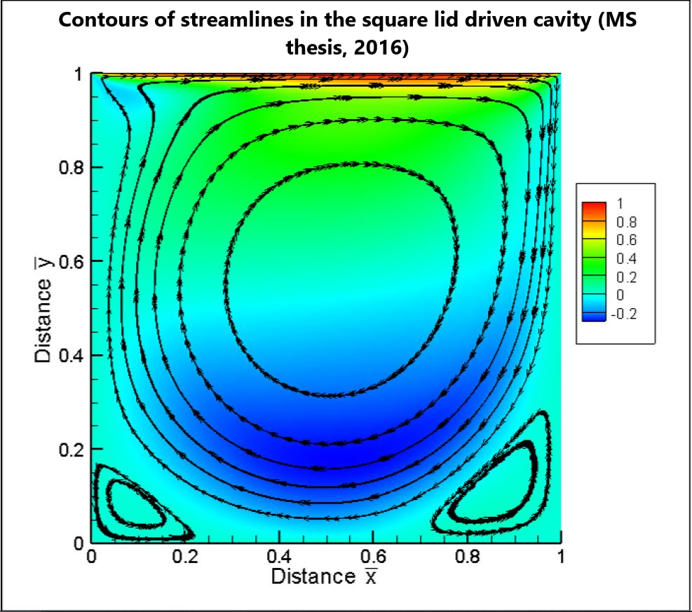
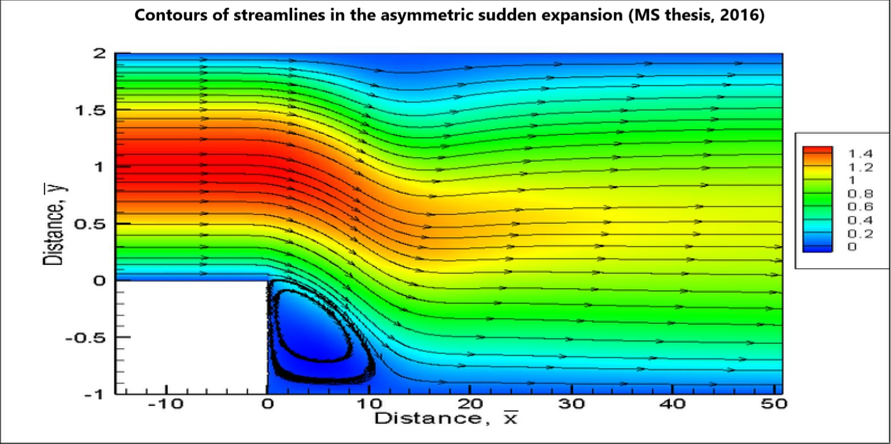

  

      <ul class="nav">
          <li><a href="https://www.linkedin.com/in/kedarisa">LinkedIn</a></li>
          <li><a href="https://scholar.google.com/citations?user=wmJICCwAAAAJ&hl=en">Google Scholar</a></li>
          <li><a href="https://github.com/sayrjked">Github</a></li>
          <li><a href="https://www.researchgate.net/profile/Sayali_Kedari">Researchgate</a></li>
          <li><a href="https://sayalikedari.blogspot.com/">Travel Photography blog</a></li>
      </ul>
  

<table class="wide">
<tr>
  <td class="left">
     
  </td>
  <td class="right">
    
  </td>
</tr>
<tr>
  <td class="left">
     
  </td>
  <td class="right">
    
  </td>
</tr>
<tr>
  <td class="left">
        
  </td>
  <td class="right">
        
  </td>
</tr>
</table>

